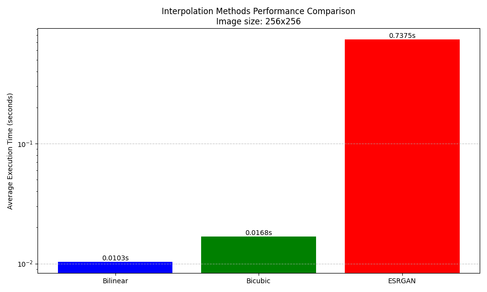
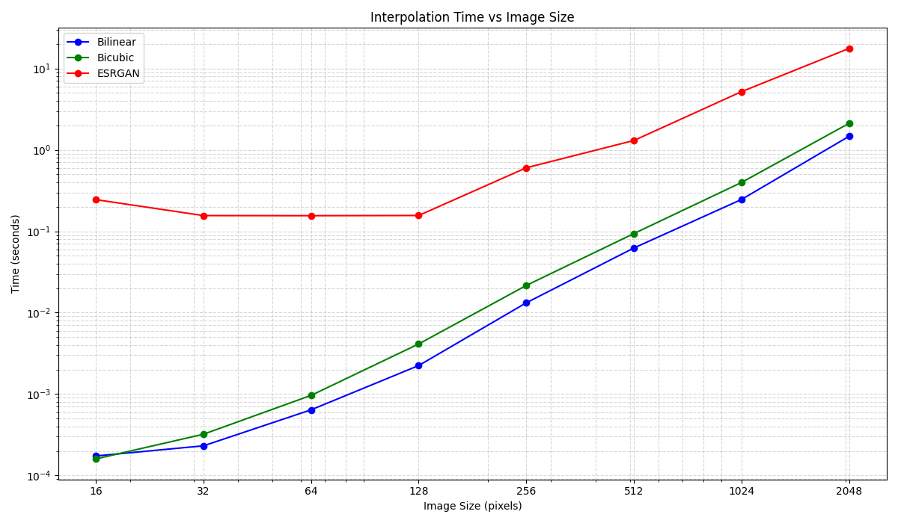

# Perf analysis

В данном разделе представлены результаты измерений производительности различных методов интерполяции изображений. Для тестирования использовались методы билинейной, бикубической интерполяции, а также нейросетевой модели RealESRGAN.

## Бенчмарки

Бенчмарки проводились с использованием скриптов, расположенных в папке `src/imgvisint`. Основные скрипты:

- `timebench.py` — измеряет время выполнения методов интерполяции для фиксированного размера изображения.
- `sizebench.py` — анализирует зависимость времени выполнения от размера изображения.

## Результаты

### Сравнение производительности методов интерполяции

На графике ниже показано среднее время выполнения каждого метода для фиксированного размера изображения (256x256 пикселей):

### Зависимость времени выполнения от размера изображения

На следующем графике представлена зависимость времени выполнения методов интерполяции от размера изображения:

## Выводы

- **Билинейная интерполяция** является самым быстрым методом, но менее точным по сравнению с бикубической интерполяцией.
- **Бикубическая интерполяция** обеспечивает более высокую точность, но требует больше времени на выполнение.
- **RealESRGAN** демонстрирует значительно более высокое время выполнения, так как использует нейросетевые вычисления, но обеспечивает наилучшее качество увеличения изображения.

Для более детального анализа и воспроизведения результатов вы можете использовать предоставленные скрипты в папке `src/imgvisint`.  