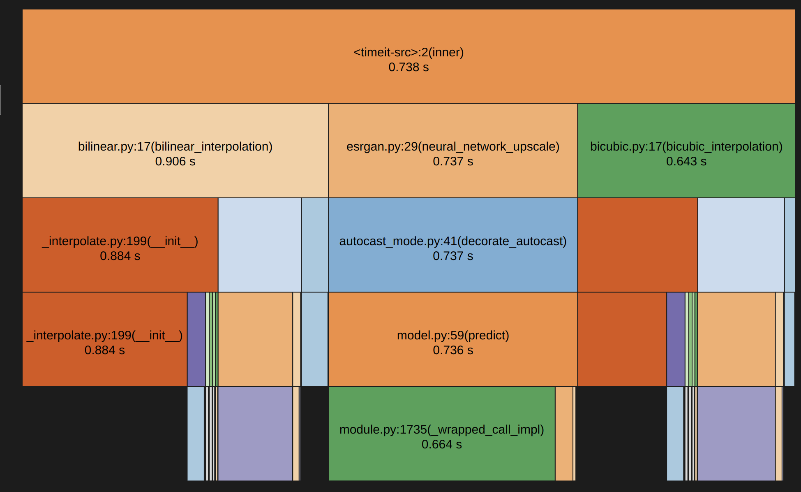
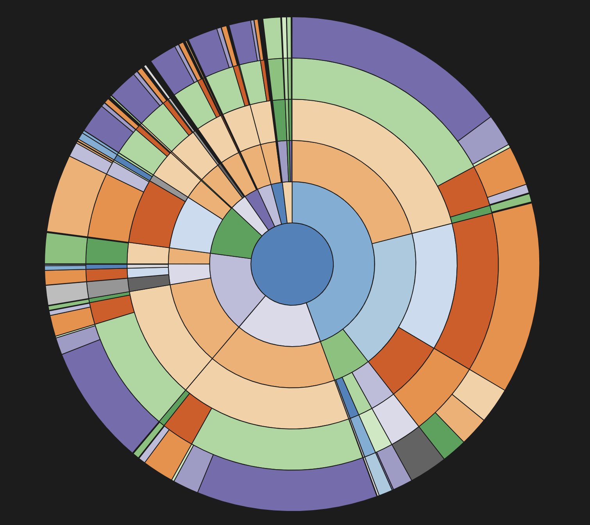

# Profiling

В данном разделе представлено описание профилирования производительности проекта с использованием инструмента `snakeviz`. Профилирование было выполнено для файла `src/imgvisint/timebench.py`, который отвечает за измерение времени выполнения различных методов интерполяции изображений.

## Используемые инструменты

- **snakeviz** — инструмент для визуализации профилей производительности Python-программ.
- **py-spy** — утилита для записи профилей производительности.

## Процесс профилирования

1. Для записи профиля производительности использовалась команда:
    ```bash
    python -m cProfile -o profile.prof src/imgvisint/timebench.py
    ```

2. Для визуализации профиля использовалась команда:
    ```bash
    snakeviz profile.prof
    ```

## Результаты профилирования

### График вызовов функций

На графике ниже представлена визуализация вызовов функций в процессе выполнения скрипта `timebench.py`:



### Распределение времени выполнения

На следующем графике показано распределение времени выполнения между различными функциями:



## Выводы

Профилирование позволило выявить наиболее ресурсоемкие функции в процессе выполнения скрипта `timebench.py`. В данном случае время выполнения для модулей bilinear, bicubic и ESRGAN было сбалансировано для анализа производительности, а в профилировщике можно увидеть реальные относительные значения эффективности подмодулей в методах. __call__ метод для билинейной интерполяции выполняется вдвое быстрее __init__, в то время как для бикубической они примерно одинаковые по длительности. 